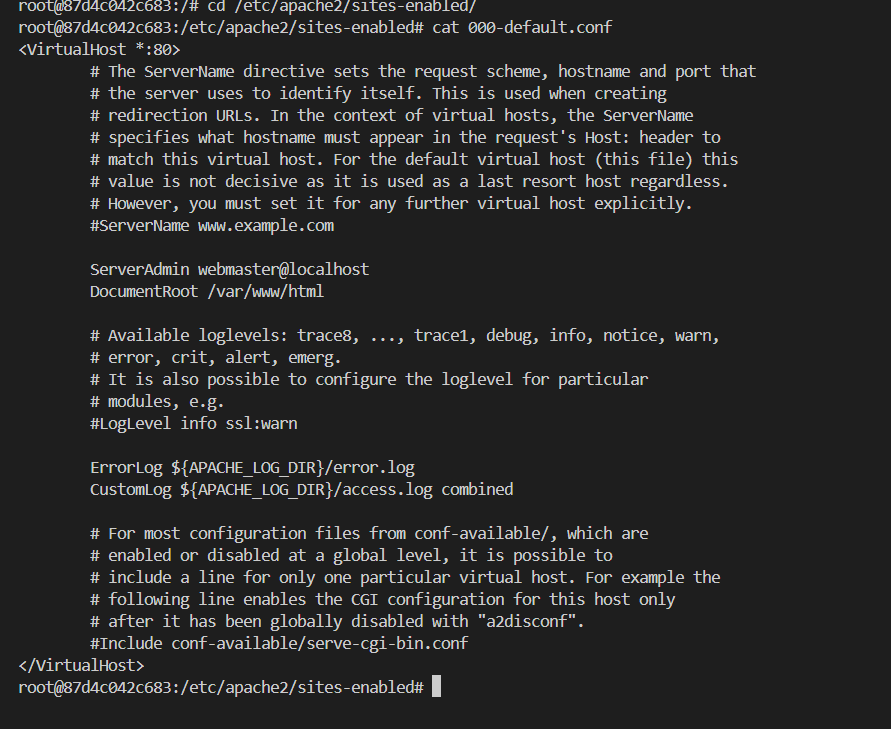

# Scop
Această lucrare de laborator are ca scop familiarizarea cu comenzile de bază ale OS Debian/Ubuntu. De asemenea, aceasta va permite să vă familiarizați cu Docker și comenzile sale de bază.

# Sarcina
Pornind de la imaginea oficială a sistemului de operare Ubuntu, trebuie să creem un container care să conțină un server web Apache. Să creem o pagină web care să conțină textul "Hello, World!" și să se afișeze într-un browser.

# Realizarea lucrarii
## Realizat de Bozian Ana-Maria 07.03.2025

1. am creat un repozitoriu nou pe git hub cu numele containers04. 
2. am facut git clone in vs code prin terminal.
3. am realizat comanda  "docker run -ti -p 8000:80 --name containers04 ubuntu bash" care descarcat imaginea noua pentru ubuntu si porneste containerul care se afla pe portul 8000:80 si ii ofera terminal interactiv prin "-ti".
 
4. am realizat urmatoarele comenzi:
    apt update 
    apt install apache2 -y
    service apache2 start
    
Cu ajutorul lor se actualizeaza lista de pachete disponibile, instaleaza serverul web apache2, si il porneste.
5. am deschis in brower http://localhost:8000 . acesta este mesajul afisat:

6. am realizat comenzile:
    ls -l /var/www/html/
    echo '<h1>Hello, World!</h1>' > /var/www/html/index.html

afisam lista fisierelor in directoriul web. scriem mesajul care va fi afisat pe pagina principala.
7. am facut refresh la pagina si ne uitam:

8. am executat urmatoarele comenzi: 
    cd /etc/apache2/sites-enabled/
    cat 000-default.conf
    si ne uitam ce afiseaza: acestea sunt setarile site-ului ca default
    
9. facem exit
10. afisam lista de containere pe care o avem prin comanda : docker ps -a

11. stergem conterners04 utilizand comanda: docker rm containers04

# Concluzie
Am creat si configurat un server Apache intr-un container Docker, testand functionarea acestuia prin accesarea unei pagini web. am personalizat continutul site-ului si am analizat configuratia Apache. In final, am gestionat containerul, invatand procese esentiale pentru administrarea serviciilor web intr-un mediu Docker
